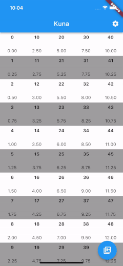
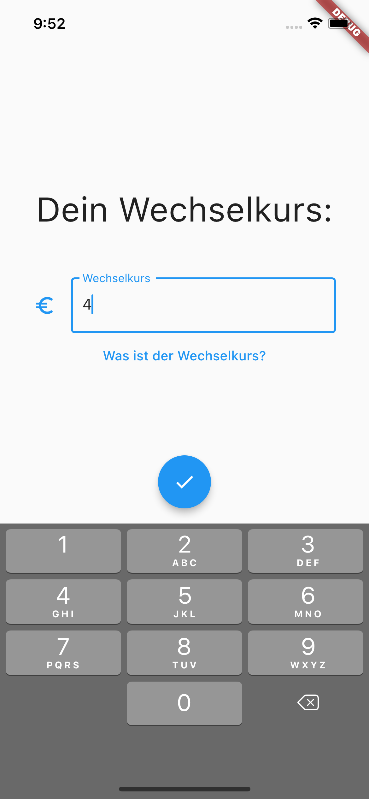
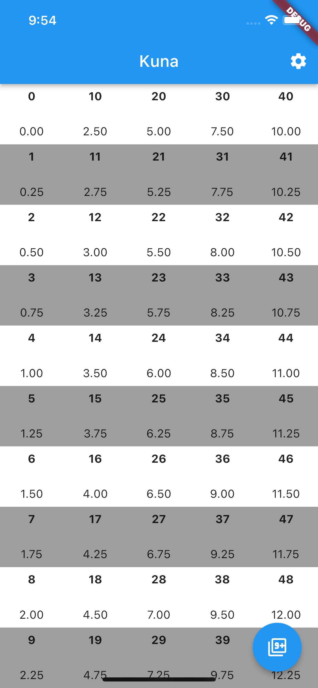
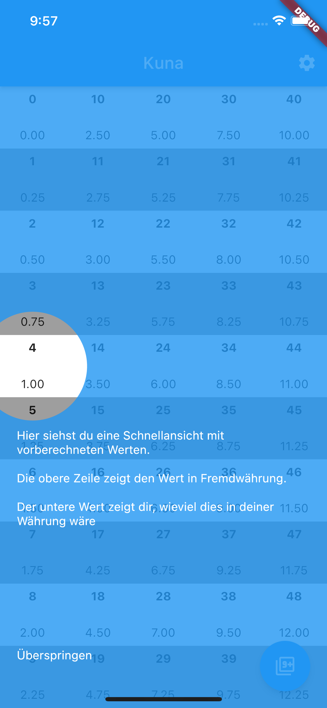
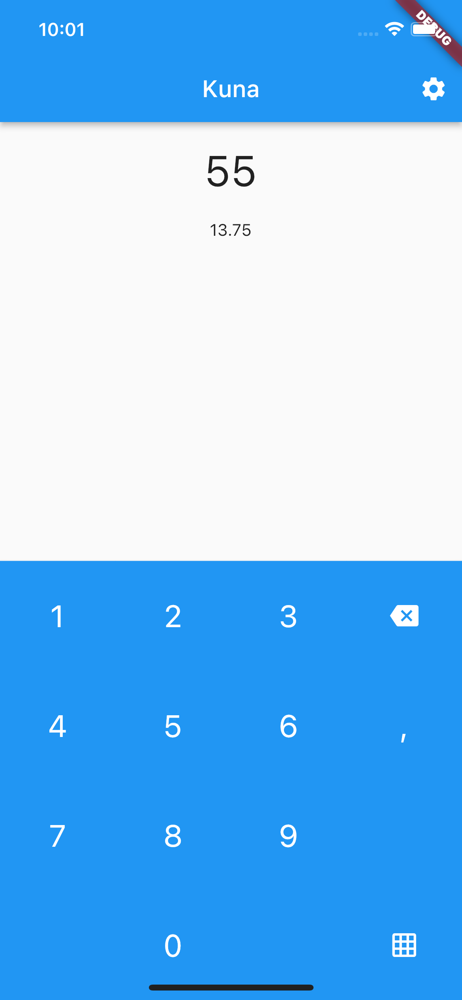
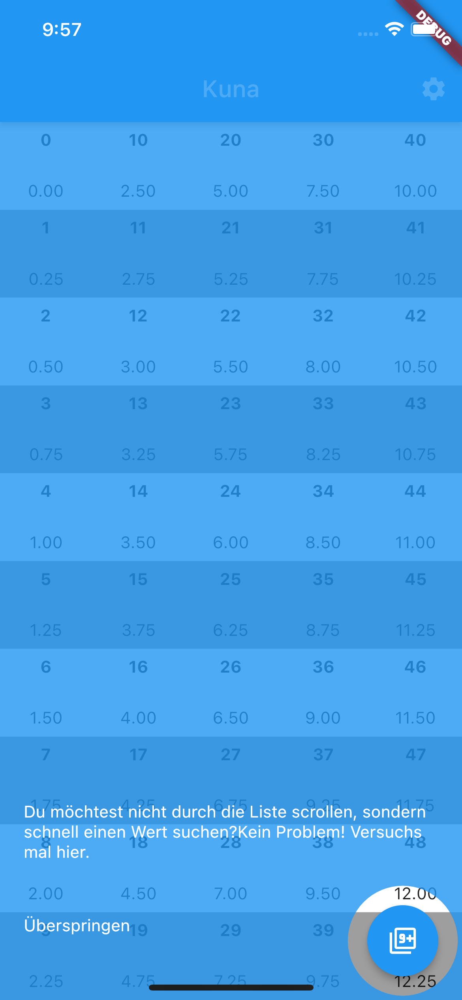

# Kuna

Kuna is a very small and simple currency calculator that was developed by myself because of the lack of ad-free currency calculators in the google play store. 

| | Description |
| --- | --- |
|  | First you have to enter the exchange rate factor you wish to view.  |

| | | Description |
| --- | --- | --- |
|  |  | Here the black bold numbers represent the value of the foreign currency and underneath the corresponding value in your native currency. E.g. 35 **foreign** would be 8.75 in your **native** currency. |

| | | Description |
| --- | --- | --- |
|  |  | If the value you're seeking is not represented in the grid you can always manually it. |

